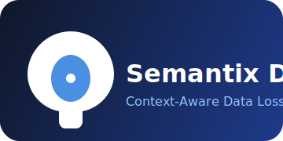

# Context-Aware DLP 🛡️

<div align="center">
  
  <h3>A semantic-first data loss prevention prototype</h3>

  [](https://fastapi.tiangolo.com/)
  [](https://www.python.org/)
  [](https://reactjs.org/)
  [](https://www.typescriptlang.org/)
  [](https://tailwindcss.com/)
</div>

## 📋 Overview

A proof‑of‑concept for context‑aware data loss prevention that goes beyond regex and keywords, leveraging semantic embeddings to catch hidden secrets and sensitive information in text.

## ✨ Features

- 🎯 **Semantic Detection**: Uses sentence embeddings instead of brittle keyword lists.
- 🔍 **Multi-Domain Coverage**: Flags passwords, API keys, PII, financial data, medical records, private keys, and more.
- 🧠 **ML‑Powered**: Trained logistic regression on 300+ curated examples with data augmentation.
- ⚡ **Real‑Time Response**: FastAPI backend for low‑latency inference.
- 💻 **Interactive UI**: React + TypeScript + Tailwind for inline analysis and notifications.
- 🔄 **Feedback Loop**: Easy to log false positives/negatives and retrain on the fly.

## 🛠️ Tech Stack

### Backend
- **Framework**: FastAPI
- **Language**: Python 3.10+
- **Machine Learning**: `sentence-transformers` (all-MiniLM-L12-v2), scikit-learn (LogisticRegression)
- **Data Augmentation**: `nlpaug` for synonym replacement
- **Serialization**: `joblib` for model persistence

### Frontend
- **Framework**: React with Vite
- **Language**: TypeScript
- **Styling**: Tailwind CSS
- **Components**: shadcn/ui, Heroicons
- **State & Fetch**: React Hooks + Fetch API (or Axios)

## 🔒 Security Features

| ✓ Semantic content analysis  | ✓ Legacy pattern fallback | ✓ Low false positives |
|------------------------------|---------------------------|-----------------------|
| ✓ PII / PHI detection        | ✓ API key spotting        | ✓ Code snippet scan   |
| ✓ Config dump detection      | ✓ Medical record flagging | ✓ Financial info flag |

## 🚀 Getting Started

### Prerequisites
- Node.js (v18+)
- Python (v3.10+)
- Git

### Installation

1. **Clone repository**
   ```bash
   git clone https://github.com/your-org/context-aware-dlp.git
   cd context-aware-dlp
   ```

2. **Backend setup**
   ```bash
   cd backend
   python3 -m venv venv
   source venv/bin/activate        # Windows: .\venv\Scripts\activate
   pip install -r requirements.txt
   ```

3. **Train or load models**
   ```bash
   python models/train_classifier.py
   ```

4. **Start FastAPI server**
   ```bash
   uvicorn app:app --reload
   ```

5. **Frontend setup**
   ```bash
   cd ../frontend
   npm install
   npm run dev
   ```

6. **Visit**
   - UI: http://localhost:3000
   - API docs: http://127.0.0.1:8000/docs

## 📂 Project Structure

```plaintext
context-aware-dlp/
├─ backend/
│  ├─ app.py                # FastAPI server
│  ├─ requirements.txt      # Python dependencies
│  ├─ models/               # Training scripts & saved models
│  └─ data/                 # Dataset CSV
│
├─ frontend/
│  ├─ public/               # Static assets (logo, index.html)
│  ├─ src/
│  │  ├─ components/        # UI components
│  │  ├─ App.tsx            # Main React entry
│  │  └─ index.css, ...     # Tailwind setup
│  └─ package.json          # JS dependencies
└─ README.md                # This file
```

## 🔮 Future Optimizations

- **Hybrid DLP**: Combine semantic layer with traditional regex for ultra‑low latency.
- **User Feedback Loop**: Auto‑retrain model on flagged false positives/negatives.
- **Multi‑Channel Analysis**: Correlate chat, email, and storage endpoints for holistic detection.

---

<div align="center">
Built with passion to secure modern workflows 🚀
</div>